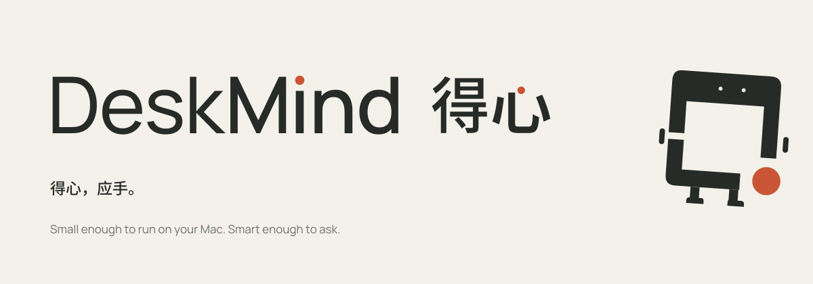

  <picture>
    <source media="(prefers-color-scheme: dark)" srcset="README-bilingual-dark.svg">
    
  </picture>

<b>Small enough to run on your Mac. Smart enough to ask.</b> 
小到能在你的 Mac 上跑，聪明到知道该问你。

<a href="https://deskmind.dev">Website · 官网</a> ·
<a href="https://deskmind.dev/docs/">Docs</a> · <a href="https://deskmind.dev/zh/docs/">文档</a> ·
<a href="https://github.com/deskmind-ai/deskmind/releases/latest"><b>Download for Mac</b></a> ·
<a href="https://huggingface.co/deskmind">Models</a> ·
<a href="https://github.com/deskmind-ai/deskmind/discussions">Discussions</a>

DeskMind is open-source computer use for your Mac. It reads the screen, works out the next step and acts, with small
models running on your Mac. When a task could mean two things, it asks instead of guessing.

- **A small model, on your Mac.** A 0.8B model decides each step and hands the unsure ones to a 4B, both locally with MLX.
- **System One: choices, not guesses.** Each step is a multiple-choice question with a probability for every option.
  Unsure steps go to the 4B or to you. Any agent can use it through `/v1/systemone`.
- **Open, from eyes to hands.** Every part below is open source, along with the bench that grades it.

**Start here: [deskmind-ai/deskmind](https://github.com/deskmind-ai/deskmind)** has the app, the demo and links to everything below. If DeskMind is useful or interesting to you, a star there helps other people find it.

| | |
|---|---|
| [**eyes**](https://github.com/deskmind-ai/eyes) | Sees the screen: finds the target when an app has no accessibility tree. |
| [**brain**](https://github.com/deskmind-ai/brain) | Decides the next step: a probability for every option, a question when unsure. |
| [**hands**](https://github.com/deskmind-ai/hands) | Acts on the desktop and checks the result before calling it done. |
| [**app**](https://github.com/deskmind-ai/deskmind/tree/main/app) | All of it in one Mac app (macOS 15+, Apple Silicon). [Download](https://github.com/deskmind-ai/deskmind/releases/latest): signed and notarized. |
| [**bench**](https://github.com/deskmind-ai/bench) | Real-desktop tasks with graders that check the final state. |
| [**deskmind**](https://github.com/deskmind-ai/deskmind) | Start here: the app, the demo, the roadmap and the launch post. |

**Current release (October 2026): DeskMind 0.3.1 with Brain G18b.** The models are on
[Hugging Face](https://huggingface.co/deskmind), mirrored on [ModelScope](https://www.modelscope.cn/models/gxcsoccer/brain-0.8b)
for downloads from China; the app switches to the mirror by itself and checks every file's SHA-256. On the real macOS desktop (bench v25, 13 tasks × 3 runs, through the app on
an M4 Pro), the 0.8B → 4B router at threshold 0.96 passed 39 of 39 runs and never said "done" early. Decision time:
about 0.5 s when the 0.8B answers, about 3.6 s when the 4B answers (about 70% of steps). Small sample; what it still
gets wrong is in [brain results](https://github.com/deskmind-ai/brain/blob/main/docs/results.md).

---

**DeskMind 得心**是在你 Mac 上运行的开源 Computer Use Agent：看屏幕、想下一步、动手操作，靠的是本机的小模型；任务有两种理解时，
它先问你，不瞎猜。

- **小模型，就在你的 Mac 上**：0.8B 判断每一步，没把握的交给 4B 重新判断，都在本机用 MLX 运行。
- **System One：选择，不是猜**：每一步是一道选择题，每个选项都有概率；没把握就交给 4B 或先问你，任何 agent 都能通过
  `/v1/systemone` 接入。
- **从眼到手，全部开源**：Eyes、Brain、Hands、Mac App 和给它们打分的 Bench。

**从 [deskmind-ai/deskmind](https://github.com/deskmind-ai/deskmind) 开始**：App、演示和所有组件的入口都在那里。觉得有用或有意思，给它点个 star，能让更多人看到。

**当前版本（2026 年 10 月）：DeskMind 0.3.1，内置 Brain G18b。**[下载 Mac 版](https://github.com/deskmind-ai/deskmind/releases/latest)
（已签名并经 Apple 公证）。模型在 [Hugging Face](https://huggingface.co/deskmind) 上，国内可从
[ModelScope](https://www.modelscope.cn/models/gxcsoccer/brain-0.8b) 镜像下载，应用会自动切换并逐个校验 SHA-256。在真实 macOS 桌面上（bench v25，13 个任务各跑 3 次，经 App 运行，M4 Pro），
0.8B → 4B 路由（门槛 0.96）39 次全部通过，没有一次没做完就说完成。决策耗时：0.8B 自己回答约 0.5 秒，交给 4B 约
3.6 秒（约 70% 的步骤）。样本不大，还做不好的地方见
[brain results](https://github.com/deskmind-ai/brain/blob/main/docs/results.zh-CN.md)。

